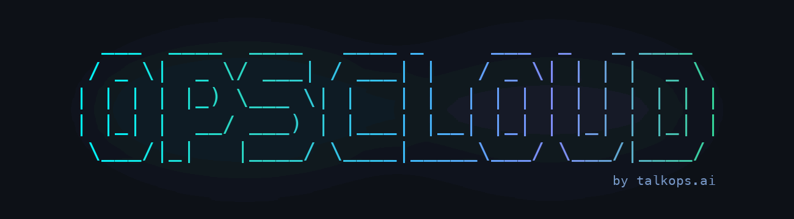

<div align="center">

<a href="https://github.com/talkops-ai/opscloud">
  
</a>

### Extensible Terminal Multi-Agent Framework for Cloud Operations & DevOps Coding

[](https://www.python.org/)
[](https://langchain.com/)
[](https://docs.langchain.com/)
[](https://github.com/talkops-ai/opscloud)
[](https://modelcontextprotocol.io/)
[](https://textual.textualize.io/)
[](LICENSE)

[Quickstart](#quickstart) • [Architecture](#architecture-at-a-glance) • [Plugin Marketplace](#pillar-2-cloud-operations-via-plugin-marketplace) • [Approval Modes](#approval-modes--governance) • [Jev System One](#jev-system-one-fast-classification--routing) • [Documentation](#documentation)

</div>

---

## Demo Walkthrough

```text
┌────────────────────────────────────────────────────────────────────────┐
│                         ▶ OpsCloud Terminal Demo                       │
│                                                                        │
│                [ Video Demo Placeholder — Recording Coming Soon ]       │
│                                                                        │
│   Hands-on DevOps coding, Jev <70ms dynamic routing, and multi-agent   │
│   cloud operations across AWS, Azure, and GCP via plugin marketplace.  │
└────────────────────────────────────────────────────────────────────────┘
```

---

## What is OpsCloud?

OpsCloud is an extensible, terminal-based multi-agent framework that unifies platform engineering coding and multi-cloud operations with strict human-in-the-loop governance:

1. **Native Platform & DevOps Coding (Main Agent)**: Built directly into the root Deep Agent. Inspects your codebase, authors production-grade Infrastructure as Code (Terraform, OpenTofu, CDK), generates Kubernetes manifests, writes CI/CD pipelines, and validates dry-runs. **Strict rule: produce reviewable diffs and plans, never blind unreviewed deployments**.
2. **Cloud Operations via Specialist Subagents (Plugin Marketplace)**: Extensible multi-agent framework connected directly to the **TalkOps DevOps Plugin Marketplace** ([`talkops-ai/devops-plugins`](https://github.com/talkops-ai/devops-plugins)). Spawns specialized domain subagents (SRE, FinOps, Cloud Security, Database) and domain skill packs across AWS, Azure, GCP, and Kubernetes for live audits, triage, and infrastructure optimization.

---

## Quickstart

### 1. Installation

**Option A: Install via Script (macOS & Linux)**
```bash
# From GitHub repository
curl -LsSf https://raw.githubusercontent.com/talkops-ai/opscloud/main/scripts/install.sh | bash

# Or from a local clone
./scripts/install.sh --local
```

**Option B: Install from PyPI**
```bash
pip install talkops-opscloud
# or using uv / pipx:
uv tool install talkops-opscloud
pipx install talkops-opscloud
```

> [!NOTE]
> On Windows, run OpsCloud inside **[WSL (Windows Subsystem for Linux)](https://learn.microsoft.com/en-us/windows/wsl/install)** for complete terminal, shell, and TUI compatibility.

### 2. Launch & Authenticate

```bash
# Start interactive TUI
opscloud

# Inside the session, configure credentials interactively:
/auth
```

Supports 22+ providers (Anthropic, AWS Bedrock, OpenAI, Gemini, Azure, Ollama, DeepSeek, TypeSafe Jev). Credentials can also be exported in your shell:

```bash
export ANTHROPIC_API_KEY="sk-ant-..."
# or: export AWS_PROFILE="production" AWS_REGION="us-west-2"
# or: export OPENAI_API_KEY="sk-..."
# or: export TYPESAFE_API_KEY="jev-..."
```

### 3. Run a Task

```text
Audit unattached EBS volumes and idle NAT Gateways across us-east-1 and us-west-2, calculate monthly cost impact, and draft Terraform deletion diffs
```

OpsCloud routes the task, delegates to domain specialists, offloads telemetry to the filesystem, and returns structured findings with copy-pasteable remediation commands.

---

## Architecture at a Glance

```text
┌─────────────────────────────────────────────────────────────────────────────────────────┐
│                                   OPSCLOUD ORCHESTRATOR                                │
├─────────────────────────────────────────────────────────────────────────────────────────┤
│  Input Prompt / Stdin ──> Unicode & Shell AST Scanner ──> Dynamic Approval Gate         │
│                                                                                         │
│  [Jev System One Router (<70ms)] ──> Selects Model Tier (Fast / Standard / Powerful)   │
│                                                                                         │
│  Ordered Middleware Pipeline (17+ Stages):                                              │
│    ConfigurableModel ──> JevRouter ──> CodeModelRetry ──> MCPContext ──> MemoryGuard    │
│    ──> PluginSkills ──> LocalContext ──> ShellAllowList ──> HITLApproval (Manual/Auto/  │
│    Smart) ──> ServerHooks ──> GoalCriteria ──> ContextCompaction ──> RubricEvaluator    │
│                                                                                         │
│  Delegation & Isolation:                                                                │
│    ┌───────────────────┬───────────────────┬───────────────────┬───────────────────┐    │
│    ▼                   ▼                   ▼                   ▼                   ▼    │
│  [Project Agents]    [Plugin Agents]     [User Agents]      [Async Agents]   [Sandboxes]│
│  (.opscloud/agents) (devops-plugins)    (~/.opscloud/agents) (config.toml)  (Modal/Day) │
│    └───────────────────┴───────────────────┴───────────────────┴───────────────────┘    │
│                                           │                                             │
│                                           ▼                                             │
│                       SubagentMemoryStore (Context Sandboxed)                           │
└─────────────────────────────────────────────────────────────────────────────────────────┘
```

### Core Architecture Highlights

- **System Prompts**: Composed dynamically with model identity injection, cloud provider awareness (AWS, Azure, GCP, Multi-Cloud), filesystem discipline (`edit_file` over sed/awk), and strict artifact vs. chat separation.
- **Middleware Pipeline**: Strict 17-stage LangGraph execution pipeline handling model retries, stalling recovery, headless MCP tiering, live cost tracking, shell allowlists, lifecycle hooks, and context compaction.
- **Jev System One Integration**: Sub-70ms dynamic model routing, <100ms tool-call safety classification, and <200ms parallel rubric acceptance testing.
- **Sandboxes**: Transparent execution in ephemeral cloud sandboxes (Modal, Daytona, LangSmith, AgentCore, Runloop, Docker) with bi-directional workspace sync.
- **Config & Secret Hierarchy**: Pure filesystem-backed persistence (`~/.opscloud/` and `.opscloud/`) with zero database dependencies.

---

## The Two Core Pillars

### Pillar 1: Built-in Coding Agent (Deep Agent + Platform Skills)

- **Infrastructure as Code (IaC)**: Production-grade Terraform (HCL), OpenTofu, Terragrunt, AWS CDK (TypeScript/Python), CloudFormation, and Pulumi with state locking, modular design, and dry-run validation.
- **Containers & Kubernetes**: Manifests (Deployments, StatefulSets, CRDs), Helm charts, Kustomize overlays, and Dockerfiles with non-root security contexts and resource boundaries.
- **CI/CD & GitOps Automation**: GitHub Actions, GitLab CI/CD, ArgoCD ApplicationSets, and Tekton pipelines with pinned actions and secret masking.
- **Platform Tooling**: Idempotent Bash scripts, Python platform CLI utilities (boto3, click, typer), and Makefiles.
- **Policy & Observability**: OPA/Rego policies, Kyverno rules, Prometheus alert rules, Datadog/CloudWatch monitors, and Grafana dashboard JSON models.

### Pillar 2: Cloud Operations via Plugin Marketplace

OpsCloud connects directly to the **TalkOps DevOps Plugin Marketplace** ([`talkops-ai/devops-plugins`](https://github.com/talkops-ai/devops-plugins)):

- **Agent Plugins (Specialist Subagents)**: Domain subagents with isolated memory and dedicated MCP tools:
  - `aws-finops-agent`: Audits spend, uncovers idle infrastructure, analyzes Savings Plans.
  - `aws-sre-agent`: Investigates CloudWatch alarms, traces distributed errors with X-Ray, isolates root causes.
  - `aws-iac-engineer`: Architects and validates CDK, CloudFormation, and Terraform modules.
  - `aws-cloud-security-engineer`: Audits IAM policies, inspects Security Hub/GuardDuty findings.
  - `aws-database-engineer`: Tunes queries, provisions Aurora, DynamoDB, RDS instances.
  - `aws-platform-engineer`: Manages EKS clusters, ECS services, VPC topologies.
- **Vertical Plugins (Domain Skill Bundles)**: Injects skills directly into the orchestrator (`aws-networking`, `aws-containers`, `aws-cost-optimization`, `aws-observability`).
- **Partner Plugins**: Official third-party skills (e.g., HashiCorp official Terraform skill collection).

```bash
# Manage plugins via CLI
opscloud plugin marketplace add talkops-ai/devops-plugins
opscloud plugin install aws-sre-agent
opscloud plugin install aws-finops-agent
opscloud plugin list
```

---

## Dynamic Subagent Architecture

OpsCloud does not hardcode subagents into the binary. Domain subagents are discovered dynamically:

1. **Agent Plugins**: Installed via the marketplace, bundling domain prompts, scoped skills, and isolated MCP servers.
2. **Project Definitions**: Committed in `.opscloud/agents/` or `.agents/`.
3. **User Definitions**: Stored in `~/.opscloud/agents/` or `~/.agents/`.
4. **Async Remote Subagents**: Declared in `config.toml` under `[async_subagents]`.

### Key Isolation Features
- **SubagentMemoryStore**: Heavy exploration, large CLI dumps, and lint iterations remain sandboxed inside the subagent's execution branch; only clean, structured deliverables return to the orchestrator.
- **Dual-Level Context Compaction**: `CLICompactionMiddleware` independently compacts both orchestrator and subagent histories when context budgets approach thresholds.
- **System Tool Whitelist**: Critical tools (`compact_conversation`, `ask_user`) remain available regardless of subagent tool filtering.

---

## Approval Modes & Governance

OpsCloud enforces human-in-the-loop safety to protect cloud environments:

| Mode | Flag | Safety Engine | Best For |
|---|---|---|---|
| **Manual** *(default)* | Default | Prompts human before every mutating action | Production clusters, live cloud accounts |
| **Auto** | `-y`, `--auto-approve` | Evaluates safety via primary LLM reasoning | Non-interactive headless scripts (`-p`) |
| **Smart** | `--smart` | **TypeSafe AI Jev System One** (<100ms classifier) | Interactive developer workflows with sub-second gating |

Toggle modes dynamically at runtime inside the TUI with **`Shift+Tab`**:
```text
Manual ──> Auto ──> Smart ──> Manual
```

### Defense-in-Depth Scanners
- **Shell AST Scanner**: Validates shell commands against allowlists (`-S recommended`, `-S all`, or CSV).
- **Unicode Security Scanner**: Detects Trojan Source, bidirectional text overrides, and homoglyphs.
- **SSRF Guard**: Blocks outbound calls to cloud metadata (`169.254.169.254`) and private RFC-1918 subnets.
- **Headless MCP Guard**: Categorizes MCP tools into 4 tiers (`READ_ONLY`, `MUTATING_SAFE`, `MUTATING_DESTRUCTIVE`, `PRIVILEGED`).

---

## Jev System One: Fast Classification & Routing

OpsCloud deeply integrates TypeSafe AI Jev System One:

1. **Smart Approval Gate (<100ms)**: Scores `mutating_probability`, `blast_radius`, and `risk_level` (0=Safe, 1=Controlled, 2=Critical) to emit sub-second interrupt verdicts.
2. **Dynamic Model Router (<70ms)**: Classifies prompt complexity in <70ms and routes to the optimal pool tier:
   - **Fast Tier** (Haiku / Flash / GPT-4o-mini): File reads, linting, git status.
   - **Standard Tier** (Sonnet / GPT-4o): General coding, Kubernetes manifests, Terraform modules.
   - **Powerful Tier** (Claude 3.7 Thinking / o1 / DeepSeek R1): Multi-file refactoring, distributed architecture, incident root cause.
3. **Hybrid Rubric Grader**:
   - **Tier 1 (Jev System One Fast-Pass)**: Evaluates acceptance criteria against task evidence in parallel in <200ms.
   - **Tier 2 (Frontier LLM Fallback)**: Diagnoses failed criteria and generates remediation advice for the worker agent.

---

## Configuration & Credential Resolution

### Configuration Precedence Order
1. CLI Flags (`-M`, `--smart`, `-S`)
2. `OPSCLOUD_*` prefixed environment variables
3. Standard environment variables (`OPENAI_API_KEY`, `AWS_REGION`)
4. Project-level `.opscloud/config.toml`
5. User-level `~/.opscloud/config.toml`
6. Built-in defaults

### Credential Loading Order
1. `OPSCLOUD_{KEY}` shell environment variable
2. Standard environment variable (`ANTHROPIC_API_KEY`, `TYPESAFE_API_KEY`, etc.)
3. Nearest project `.env` (walked up from current working directory)
4. User global `~/.opscloud/.env` (saved with `0600` permissions via `/auth`)
5. Cloud native provider chain (AWS IAM/SSO/boto3 session, GCP ADC, Azure Managed Identity)

---

## CI/CD Rubric Closed-Loop Verification

Enforce quality gates in CI/CD pipelines with automated rubric grading:

```bash
opscloud -p "Create an AWS EKS Cluster Autoscaler Helm values configuration" \
  --rubric "1. AWS IAM role ARN referenced in serviceAccount annotations.
2. Balance-similar-node-groups flag is enabled.
3. Expander strategy set to least-waste.
4. Scale-down-utilization-threshold is configured.
5. Resource requests and limits explicitly defined." \
  --rubric-model "anthropic:claude-3-5-sonnet-latest" \
  --rubric-max-iterations 3 \
  --smart
```

```text
┌────────────────────────────────────────────────────────┐
│                   Rubric Evaluation Loop               │
├────────────────────────────────────────────────────────┤
│ 1. Worker Agent drafts code/manifests in workspace     │
│ 2. Grader evaluates work tree against rubric criteria  │
│ 3. If PASS ──> Exit 0, emit JSON verification report   │
│ 4. If FAIL ──> Grader feeds back remediation guidance   │
│ 5. Worker iterates on fixes and re-submits to Grader   │
│ 6. Repeats until PASS or max iterations reached        │
└────────────────────────────────────────────────────────┘
```

---

## Remote Cloud Sandboxes

Run heavy or untrusted workloads in isolated cloud containers via `--sandbox`:

```bash
# Launch inside an ephemeral cloud sandbox
opscloud --sandbox modal "Compile and test the cross-platform platform binary"
```

Supported providers: **Modal**, **Daytona**, **LangSmith**, **AgentCore**, **Runloop**, **Vercel**, and **Docker**. Workspace files synchronize bi-directionally, excluding build caches (`.git`, `.venv`, `.terraform`, `node_modules`).

---

## CLI Reference Summary

```bash
# Basic Usage
opscloud [OPTIONS] [PROMPT]

# Common Subcommands
opscloud auth list | set <provider> | remove <provider>
opscloud config show | list | get <key> | set <key> <value>
opscloud pool show | set <tier> <model> | reset
opscloud plugin list | install <id> | uninstall <id> | marketplace add <url>
opscloud skills list | info <name> | find <query>
opscloud mcp list | tools
opscloud threads list | delete <id>
opscloud doctor

# Key Flags
-p, --prompt TEXT                # Headless single-task execution prompt
-r, --resume [ID]                # Resume a previous conversation thread
-M, --model MODEL                # Primary model specifier (provider:model)
-a, --agent NAME                 # Launch with a specific dynamic subagent
-s, --skill NAME                 # Pre-load a specific skill
--approval-mode MODE             # Approval mode: manual, auto, or smart
-y, --auto-approve               # Enable classic classifier-backed Auto mode
--smart                          # Enable Jev-powered Smart approval mode (<100ms)
-S, --shell-allow-list LIST      # Shell allowlist (recommended, all, or custom CSV)
--effort LEVEL                   # Reasoning effort (off, low, medium, high)
--goal TEXT                      # Interactive goal with acceptance criteria
--rubric TEXT|@PATH              # Automated rubric grading loop
--rubric-model MODEL             # Grader model for rubric evaluation
--rubric-max-iterations N        # Max grading iterations
--sandbox [TYPE]                 # Ephemeral cloud sandbox provider
```

---

## Documentation Hub

Complete technical documentation is available in [`docs/opscloud-docs/`](docs/opscloud-docs/):

| Guide | Description |
|---|---|
| **[Overview](docs/opscloud-docs/overview.md)** | Core capabilities, dual-engine architecture, and environment configuration |
| **[Quickstart](docs/opscloud-docs/quickstart.md)** | Step-by-step setup, TUI controls, slash commands, and first steps |
| **[CLI Reference](docs/opscloud-docs/cli-reference.md)** | Complete CLI flags, subcommands, and non-interactive scripting options |
| **[Configuration](docs/opscloud-docs/Configuration.md)** | Configuration precedence, directory layouts, and runtime environment options |
| **[config.toml Reference](docs/opscloud-docs/config.toml.md)** | Full specification for model pools, UI, permissions, and compaction |
| **[Provider Credentials](docs/opscloud-docs/credentials.md)** | Credential setup for 22+ providers via `/auth` and environment variables |
| **[Approval Modes & Security](docs/opscloud-docs/approval-mode.md)** | Manual, Auto, Smart modes, Jev System One classifier, and AST scanners |
| **[Subagents](docs/opscloud-docs/subagents.md)** | Dynamic subagent discovery, isolated memory stores, and context compaction |
| **[Plugins & Marketplaces](docs/opscloud-docs/plugins.md)** | Community and private enterprise plugin architecture and discovery |
| **[Model Providers & Router](docs/opscloud-docs/model-providers.md)** | 22+ model providers, Jev dynamic routing (<70ms), and reasoning effort |
| **[Remote Sandboxes](docs/opscloud-docs/remote-sandboxes.md)** | Cloud sandbox execution with Modal, Daytona, LangSmith, and Docker |
| **[Goals & Rubrics](docs/opscloud-docs/goal-and-rubrics.md)** | Interactive goal tracking and automated CI/CD rubric grading loops |
| **[Lifecycle Hooks](docs/opscloud-docs/hooks.md)** | Deterministic pre/post-tool execution scripts via `hooks.json` |
| **[MCP Tools](docs/opscloud-docs/mcp-tools.md)** | Model Context Protocol setup, security tiers, and TUI inspector |
| **[Memory & Skills](docs/opscloud-docs/memory-and-skills.md)** | Workspace memory persistence, skill hierarchy, and convention learning |

---

## Contributing

Contributions are welcome. Please review our [Contributing Guidelines](CONTRIBUTING.md) and [Security Policy](SECURITY.md) before submitting a pull request.

```bash
git clone https://github.com/talkops-ai/opscloud.git
cd opscloud
uv venv && source .venv/bin/activate
uv pip install -e ".[dev,test-integration]"
uv run pytest tests/unit_tests/ -v
```

---

## License

OpsCloud is open-source software licensed under the [Apache License 2.0](LICENSE).
